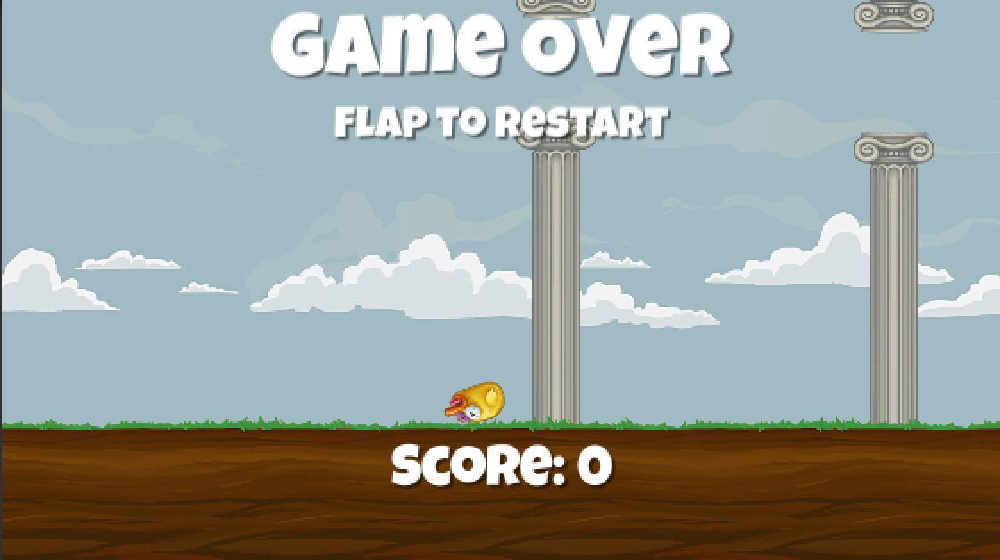

# Flappy Bird

Flappy Bird es un juego para móviles de 2013 desarrollado en Hanói por el desarrollador vietnamita Nguyen Hà Đông (Dong Nguyen) y publicado por .GEARS Studios, un pequeño desarrollador de juegos independiente, también con sede en Vietnam. El juego, publicado el 24 de mayo de 2013, fue eliminado de App Store y Google Play por su creador el 9 de febrero de 2014.

El jugador controla un pájaro intentando volar entre filas de tuberías verdes sin tocarse con estas. La escena se va desplazando lateralmente. El desarrollador creó el juego en varios días utilizando como personaje central un pájaro que diseñó para otro juego cancelado en 2012.

## Imágenes

## Éxito y cierre

Este juego rápidamente empezó a acumular descargas hasta llegar a ser el más descargado en todas las tiendas de apps para sorpresa incluso de su creador. Este inesperado éxito fomentó la aparición de miles de imitadores. Tras el creciente éxito de Flappy Bird, el creador del juego, anunció en su cuenta de Twitter que eliminaría el juego, y el 9 de febrero de 2014 a las 17:00 (GMT) lo retiró del App Store y de Google Play.

Según su declaración inicial, eliminó el juego de las tiendas móviles porque algunos medios aseguraban que Nguyen llegó a recibir hasta $90.000 dólares estadounidenses al día únicamente con el pequeño banner que mostraba esa aplicación en la parte inferior de la pantalla; poniéndolo en una posición peligrosa para su persona.1​
Más tarde, Dong aseguró en una entrevista al sitio web de la revista Rolling Stone,2​ que la razón principal por la que eliminó el juego:

«Había recibido e-mails de fanáticos de Flappy Birds alegando que era tan adictivo como el crack y esto frustraba a la gente»
Agregó también que, muy por el contrario, su intención inicial era
«crear un juego que las personas pudieran disfrutar durante diez minutos, en un contexto de relax, no dedicarle horas tratando de alcanzar un puntaje superior».

Tras su desaparición, una gran cantidad de personas han intentado vender sus teléfonos móviles con el juego instalado a precios estratosféricos, hasta llegar al punto de que eBay tuvo que retirar la subasta de móviles con el juego.

### Legado

El cierre del proyecto y posterior retiro de los mercados no fue óbice para que Flappy Birds desapareciera definitivamente. Además, como en todo producto de éxito todas las plataformas se llenaron rápidamente de clones jugando al equívoco con el nombre o cambiando protagonista. No han dejado de publicarse juegos estilo "Flappy" desde que el juego del desarrollador vietnamita irrumpiera en el mercado.

## Built With

* [Unity3D](https://unity3d.com/es) - The ultimate game development platform.
* [MonoDevelop](http://www.monodevelop.com/) - C# IDE

## Authors

* **José Joaquín Pérez-Calderón Ortiz**

## License

  Copyright [2018] [José Joaquín Pérez-Calderón Ortiz] Licensed under the
	Educational Community License, Version 2.0 (the "License"); you may
	not use this file except in compliance with the License. You may
	obtain a copy of the License at

  http://www.osedu.org/licenses/ECL-2.0

	Unless required by applicable law or agreed to in writing,
	software distributed under the License is distributed on an "AS IS"
	BASIS, WITHOUT WARRANTIES OR CONDITIONS OF ANY KIND, either express
	or implied. See the License for the specific language governing
	permissions and limitations under the License.

## Acknowledgments

* Unity2D Docs
* etc
